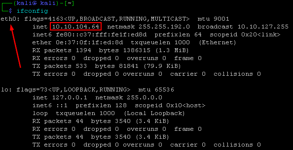
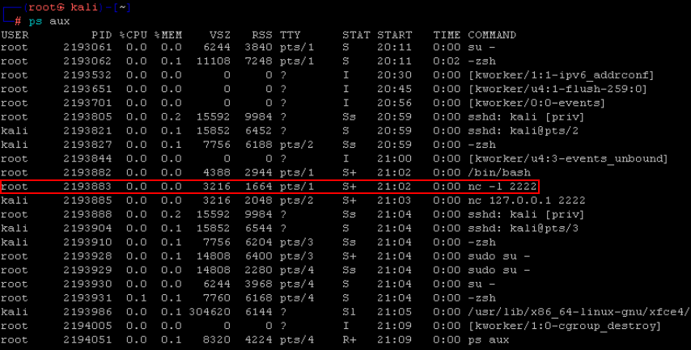
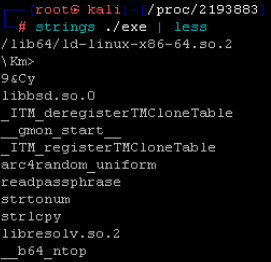

# Linux CLI

In this lab we will be looking at a backdoor through the lens of the the Linux CLI.

We will be using a large number of different basic commands to get a better understanding of what the backdoor is and what it does.

For this lab we will be running **three** different Ubuntu terminals.

 > Terminal 1 is where the backdoor will be run.

 > Terminal 2 is where we will connect to the back door.

 > Terminal 3 is where we will be running our analysis.

***

Let’s get started by opening a Terminal as Administrator, there are a few methods to do this.  

Method 1 is to right click on the desktop and select open. 

Method 2 is to simply click on the Kali logo in the taskbar.

When you get the User Account Control Prompt, select Yes.

And, open a **Ubuntu** command prompt:

==####NOTE#####== 

If you are havin trouble launching any of Windows many terminals.  All you have to do is click on the Windows Start button and type.  

`Powershell`, `Ubuntu`, or `Command Prompt` 

If you use **PowerShell** or **Command Prompt**, you will have to right click on them and select Run As Administrator 

==###END NOTE###==

***

On your **Linux** terminal, please run the following command:

`sudo su - `

The password is adhd.

This will get us to a root prompt. We want to do this because we want to have a backdoor running as root and a connection from a different user account on the system.

Next, we will need to create a **FIFO** backpipe:

`mknod backpipe p`

Next, let's start the backdoor:

`/bin/bash  0<backpipe | nc -l 2222 1>backpipe`

In the above command, we are creating a **Netcat listener** that forwards all input through a backpipe and then into a bash session.  It then takes the output of the bash session and puts it back into the **Netcat listener**. 

On a more basic level, this will create a backdoor listening on port 2222 of our **Linux** system.

Now, let's open another **Ubuntu** terminal.  This terminal will connect to the backdoor we just created.  

Method 1 is to right click on the desktop and select open. 

Method 2 is to simply click on the Kali logo in the taskbar.

Now we will need to know the IP address of our **linux** system:

`ifconfig`

Now, let's connect:

`nc 127.0.0.1 2222`

Remember!!!  Your IP address will be different!!!!

***

It can be confusing to tell whether or not you are connected to the backdoor.  A few ways to confirm are as follows.  

1. Typing some commands to ensure it is working

`ls`

`whoami`

2. If your cursor drops down to the bottom left side of your screen.

***

At this point, we have created a backdoor with one terminal, and we have connected to this backdoor with another terminal.  Now, let's open yet another **Ubuntu** terminal and use this use for the purpose of analysis.  

Let's begin by using one of the two methods used earlier to open a new **Ubuntu** Terminal.  

Method 1 is to right click on the desktop and select open. 

Method 2 is to simply click on the Kali logo in the taskbar.

On your Linux terminal, please run the following command:

`sudo su -`

This will get us to a root prompt.  When we say root prompt we mean a terminal with the highest level of permission possible.  We want to be in a root prompt because looking at network connections and process information system wide requires root priviledges (or the highest level of priviledges).  

Let's start by looking at the network connections with **lsof**.  When we use **lsof**, we are looking at open files.  When we use the **-i** flag we are looking at the open Internet connections.  When we use the **-p** flag we are telling **lsof** to not try and guess what the service is on the ports that are being used. Just give us the port number.

`lsof -i -p`

Now let's dig into the **netcat process ID**.  We can do this with the lowercase **-p** switch.  This will give us all the open files associated with the listed process ID.

`lsof -p 131`

Let's look at the full processes.  We can do this with the **ps** command. We are also adding the **aux switches**.  

aux
* a is for all processes
* u is for sorted users
* x is for all processes using a teletype terminal

Type out this command.

`ps aux`

Let's change directories into the **proc** directory for that **pid**.  Remember, **proc** is a directory that does not exist on the drive.  It allows us to see data associated with the various processes directly.   This can be very useful as it allows us to dig into the memory of a process that is currently running on a suspect system.

`cd /proc/[pid]`

We can see a number of interesting directories here:

`ls`

Remember!!!  Your PID will be different!!!

***

We can run strings on the exe in this directory.  When programs are created there may be usage information, mentions of system libraries, and possible code comments.  We use this all the time to attempt to identify what exactly a program is doing.

`strings ./exe | less`

If we scroll down, we can see the actual usage information for netcat.  We pulled it directly out of memory!

***

