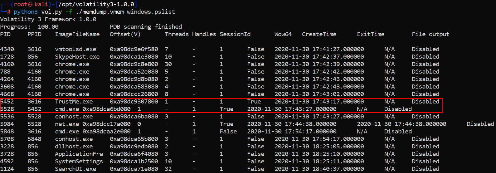
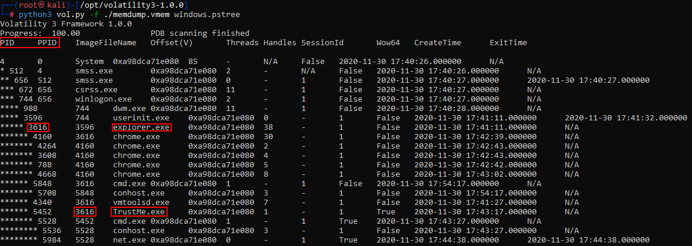

# Memory Analysis

In this lab we will be looking at a memory dump of a compromised system.  

To do this, we need to decompress it and use **Volatility** to examine the network connections and process information for the malware.  

Please keep in mind that we are using a free tool for this lab.  While **Volatility** is great, it has some limitations.  Specifically, in the area of network PIDs.  While we use **Volatility**, the same concepts can also be applied to any commercial tools you may be using in your environment.

 Let's open a command prompt and look at it with **Volatility**!

Please note this memory dump was created from **VMWare** snapshot feature. There are multiple tools like **winpmem** and **FTK Imager** that can also create memory dumps.

To start, we will open a Kali terminal. 

Alternatively, you can click on the **Kali** logo in the taskbar.

Once the terminal is up, gain root access by using the following command.

`sudo su - `

Next, we need to navigate to the appropriate directory. 

`cd /oct/Volatility3-1.0.0`

Lets begin by finding pages in the memory that have read, write, and execute priveleges.

`python3 vol.py -f ./memdump.vmem windows.malfind.Malfind`

Right away, we notice that the file **"TrustMe.exe"** looks very suspicious.

Let's continue by looking at the network connections.

`
python3 vol.py -f ./memdump.vmem windows.netscan
`

Patience, Padawan! This can take up to several minutes to complete.

The above screenshot is... concerning. Because there is a SMB (port 445) connection to another computer, we need to investigate farther.  We know it is compromised, (because it is a lab), but any time a "suspect" computer has another open connection to an internal system is, without question, a cause for concern.

Now, let's look at the processes on this system.

`
python3 vol.py -f ./memdump.vmem windows.pslist
`

The **cmd.exe** should catch your attention. Generally, users and day to day usage of a system does not spawn a **cmd.exe** session. There is a chance that it can appear briefly as part of a sysadmin script, but it is not a normal sight and very oftain not seen in day-to-day life.  

Let's look at **pstree** to see a bit more detail on what spawned what.

`
python3 vol.py -f ./memdump.vmem windows.pstree
`

You can see that we traced back the parent process for one of the cmd.exe files back to **TrustMe.exe**. When hunting down these processes it helps to track the parent processes. It can help create a sort of timeline for the actions on the system.

In the above example, we can also see that the parent process for **TrustMe.exe** was **Explorer.exe**. This means it was invoked by the user on the system, as **Explorer.exe** is the GUI process for Windows 10.

Let's now dive into the **TrustMe.exe** process a bit further with **dlllist**. For this command, we will use the PID of **TrustMe.exe**, which is 5452.

`
python3 vol.py -f ./memdump.vmem dlllist --pid 5452
`

You can see the **dll's** associated with the **TrustMe.exe** process.

We can also see the command line invocation of this process. These lines tell us any flags used to start the process as well as where on the system it was executed from.  

