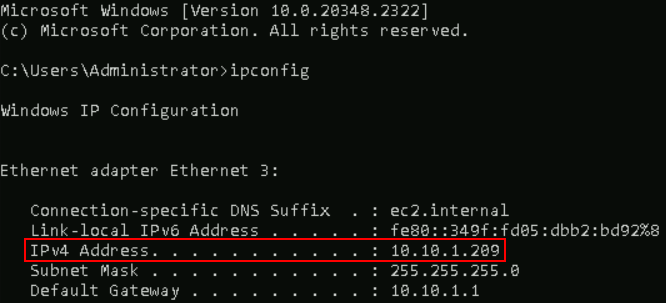
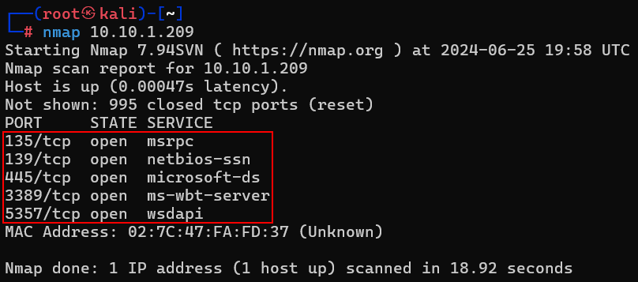

# Host Firewalls and Nmap

In this lab we will be scanning your **Windows** system from your **Linux** terminal with the firewall both on and off. 

The goal is to show you how a system is very different to the network with a firewall enabled. 

Remember, treat your internal network as hostile, because it is.

Let's get started by opening a command prompt terminal. You can do this by clicking the icon in the taskbar.

From the command prompt we need to get the IP address of your **Windows** system:

If you are having trouble with Windows Terminal, you can simply start each of the three shells, we use by starting them directly from the Windows Start button. 

 

Simply click the Windows Start button in the lower left of your screen and type: 

 

`Powershell` 

or 

`Ubuntu`

or 

`Command Prompt` 

 

For PowerShell and Command Prompt, please right click on them and select Run As Administrator 

###END NOTE###

From the command prompt we need to get the IP address of your Windows system:

<pre>ipconfig</pre>

Please note your IP for your system. Mine is 10.10.1.209. Yours will be different.

Now, let’s try and scan your Windows system from with a Kali terminal. Go ahead an open one up.

Alternatively, you can click on the Kali logo in the taskbar.

Let’s become root:

<pre>sudo su -</pre>

Then, we will scan your Windows system:

<pre>nmap 10.10.1.209</pre>

You can hit the spacebar to get status.

It should look like this:

Please note the open ports. These are ports and services that an attacker could use to authenticate to your system.  Or, attack if an exploit is available. 

Let’s go back to the Windows command prompt, by selecting the Administrator: Command Prompt tab.

Let’s enable the Windows firewall:

<pre>netsh advfirewall set allprofiles state on</pre>

Now, let’s rescan from the Kali terminal. You can navigate back to it by pressing the Kali logo in the taskbar:

Rerun the scan

<pre>nmap 10.10.1.209</pre>

Please note, you can just hit the up arrow key.

Once again, you can hit the spacebar to see status.

It should look like this:

Now, using the same process as before, let’s disable the Windows firewall to go back to the base state:

<pre>netsh advfirewall set allprofiles state off</pre>

