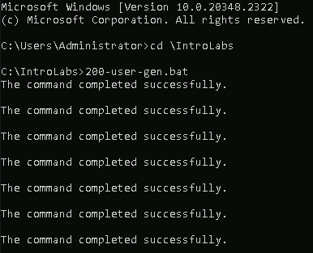

# Password Spray

First things first, disable **Defender**. Open an instance of **Windows PowerShell** by clicking on the icon in the taskbar. Then run the following:

<pre>Set-MpPreference -DisableRealtimeMonitoring $true</pre>

This will disable **Defender** for this session.

If you get angry red errors, that is Ok, it means **Defender** is not running.

Let's get started by opening a **Command Prompt** terminal by clicking on the icon in the taskbar.

Once the terminal opens, navigate into the appropriate directory by running the following command:

<pre>cd \IntroLabs</pre>

We need to run the batch file named **200-user-gen** 

Do so by typing the name of the batch file and hitting enter:

<pre>200-user-gen.bat</pre>

It should look like this:

Let this run all the way through. Even though it looks endless, it's not!

We will need to start **PowerShell** to run **"LocalPasswordSpray"**

Launch it by typing the following and hitting enter:

<pre>powershell</pre>

Run the following two commands:

<pre>Set-ExecutionPolicy Unrestricted</pre>

<pre>Import-Module .\LocalPasswordSpray.ps1</pre>

It should look like this:

Let’s try some password spraying against the local system!

<pre>Invoke-LocalPasswordSpray -Password Winter2020</pre>

It should look like this:

We need to clean up and make sure the system is ready for the rest of the labs.

Run the following two commands:

<pre>exit</pre>

<pre>user-remove.bat</pre>

Let this run all the way through. Even though it looks endless, it's not!

***

[Back to Navigation Menu](/IntroClassFiles/navigation.md)
