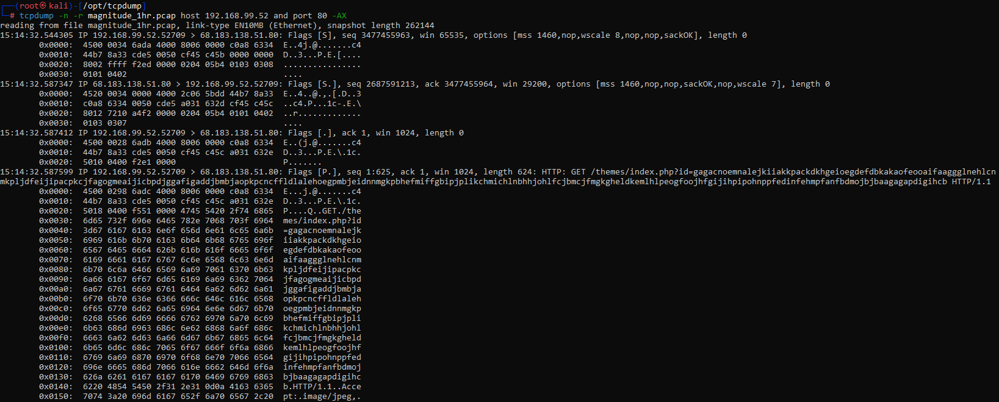
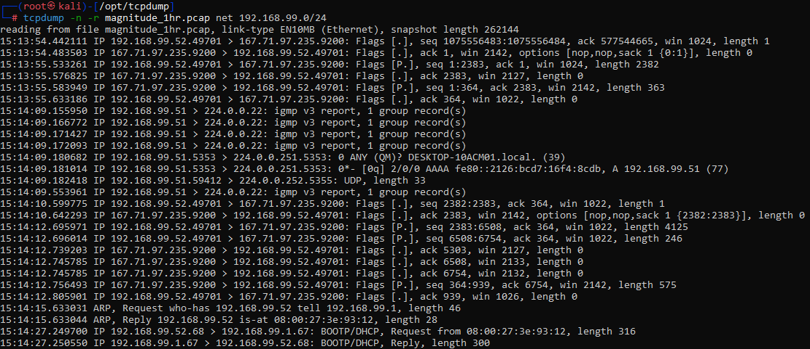

# TCPDump

In this lab we will be looking at some basic tcpdump filters every SOC and security analyst should know.

Let’s get started by opening a Terminal.

Alternatively, you can click on the Kali logo in the taskbar.

####NOTE##### 

If you are having trouble with Windows Terminal, you can simply start each of the three shells, we use by starting them directly from the Windows Start button. 

 

Simply click the Windows Start button in the lower left of your screen and type: 

 

`Powershell` 

or 

`Ubuntu`

or 

`Command Prompt` 

 

For PowerShell and Command Prompt, please right click on them and select Run As Administrator 

###END NOTE###

First, we need to get into the root shell. 

<pre> sudo su - </pre>

Next, we need to navigate to the appropriate directory. 

<pre>cd /opt/tcpdump </pre>

We are going to start with a very basic filter that simply shows us the data associated with a specific host.

The filter for this...  is host.

<pre>tcpdump -n -r magnitude_1hr.pcap host 192.168.99.52 </pre>

For this command we are telling tcpdump to not resolve hostnames (-n) and we are telling it to read in the data from a file (-r).

What exactly is this showing us?

Well, it is showing each packet's timestamp:

Its protocol:

Its source IP address/port direction and destination IP address/port :

Its control bit flags and sequence numbers:

And data size:

But we can get the filter to be a bit more granular.  In fact, you can create filters for literally every part of a packet!

Let's add port number.

<pre>tcpdump -n -r magnitude_1hr.pcap host 192.168.99.52 and port 80</pre>

You can hit ctrl + c after a few seconds:

In the screenshot above you can see we now have all the packets that are either sent or received by port 80 on 192.168.99.52.

While getting the overall metadata from the packets is nice, we can get the full ASCII decode of the packet and the payload of the packet.

<pre>tcpdump -n -r magnitude_1hr.pcap host 192.168.99.52 and port 80 -A</pre>

As you can see above, we now can see the actual http GET requests and the responses.  

Lets dig into the packet with the timestamp of 08:14:32.638976

Ouch, it looks like PowerShell!!!  A favorite of attackers and pentesters alike.  Further, it looks like there is Base64 data.

Still not enough?  We can also see the raw Hex, if that is your sort of thing, with the -X flag:

<pre>tcpdump -n -r magnitude_1hr.pcap host 192.168.99.52 and port 80 -AX</pre>

We can also specify specific protocols of interest.

For example:

<pre>tcpdump -n -r magnitude_1hr.pcap ip6</pre>

This is showing all the ipv6 traffic.

We can also specify network ranges.  This is very useful when you are seeing traffic either to or from a range of IP addresses.  For example, this can help us answer questions like "are there any other systems talking to this IP address range?" 

Think of an attacker using multiple systems on a network range to disperse their C2 traffic.

<pre>tcpdump -n -r magnitude_1hr.pcap net 192.168.99.0/24</pre>

#Going further

Want to play with some more pcaps?  Cool.

Please check out Malware of the Day from Active Countermeasures!

`https://www.activecountermeasures.com/category/malware-of-the-day/`

Below are some commands to download some of the capture files.  Try and run through the basic level analysis we just did with them.

`https://www.dropbox.com/s/zyqn3nn5ygfki59/teamviewer_1hr.pcap`

`https://www.activecountermeasures.com/pcap/apt1virtuallythere_1hr.pcap`

`https://www.dropbox.com/s/51uzphl1f3ca691/lateral_backup_c2_1hr.pcap`

`https://www.dropbox.com/s/bhgvpablx11u8yb/taidoor_1hr.pcap`

Here is a great resource to try some more options in TCPDump:

`https://danielmiessler.com/study/tcpdump/`

