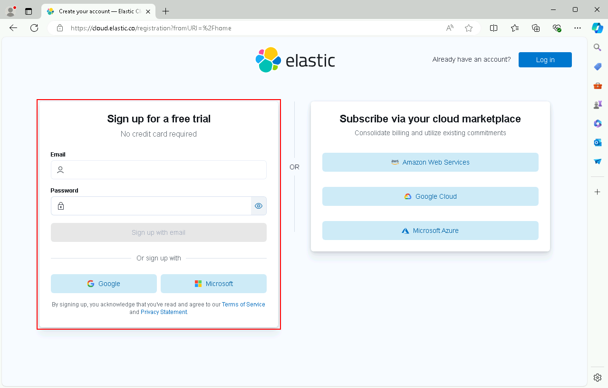
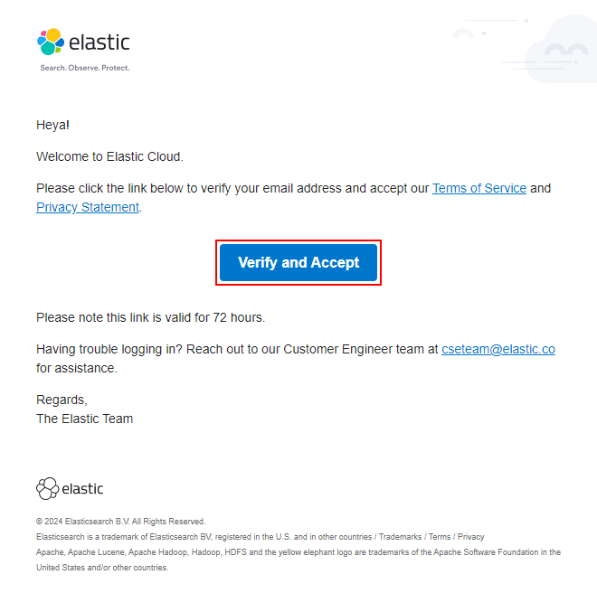
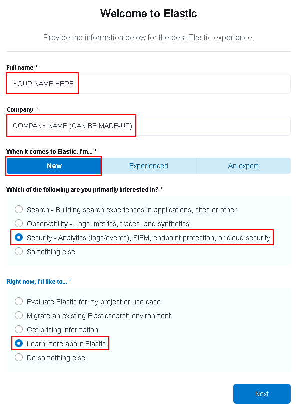
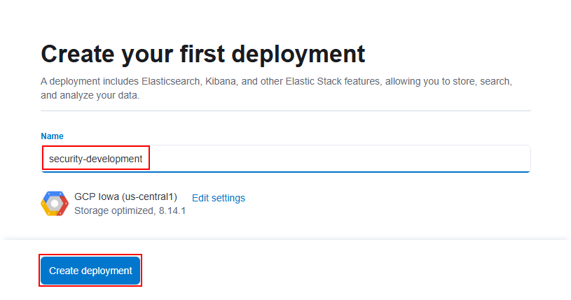
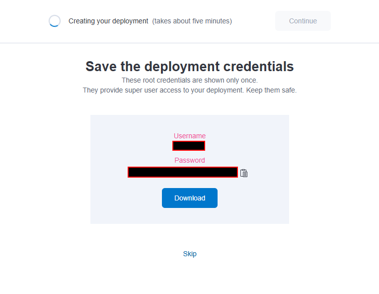
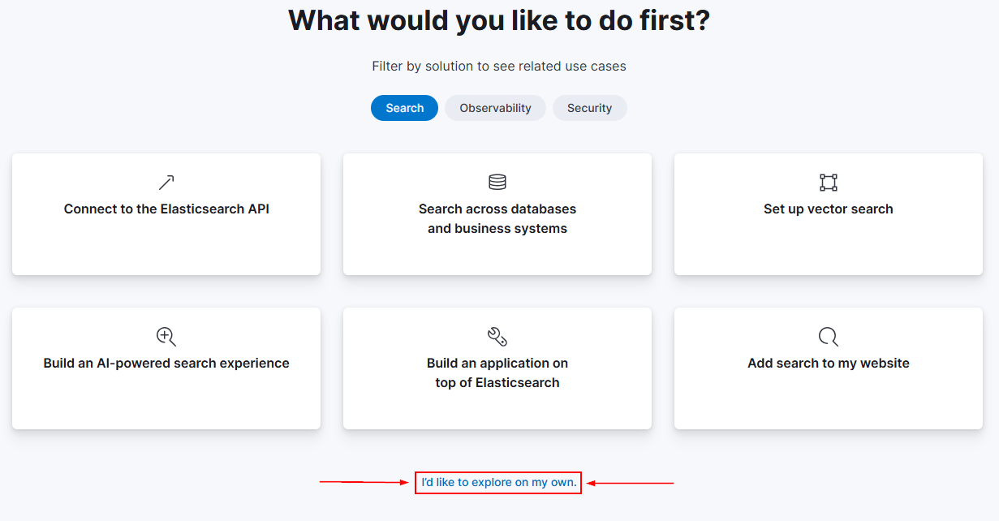
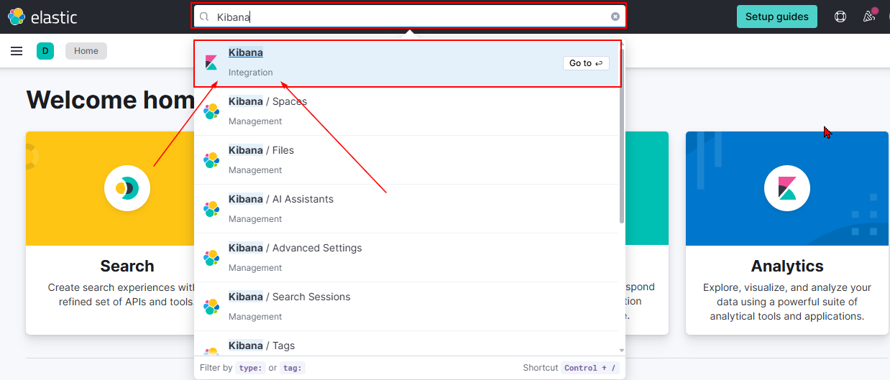
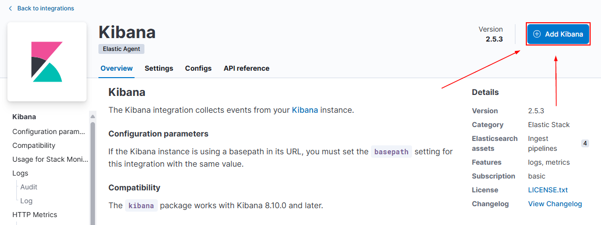
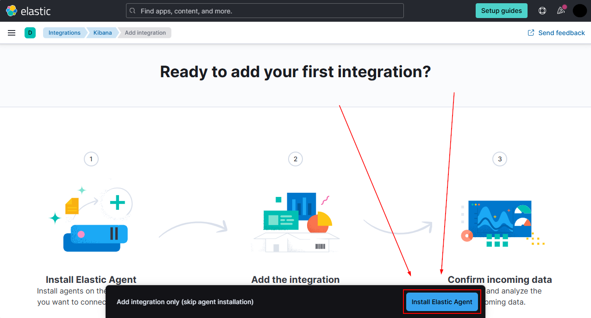
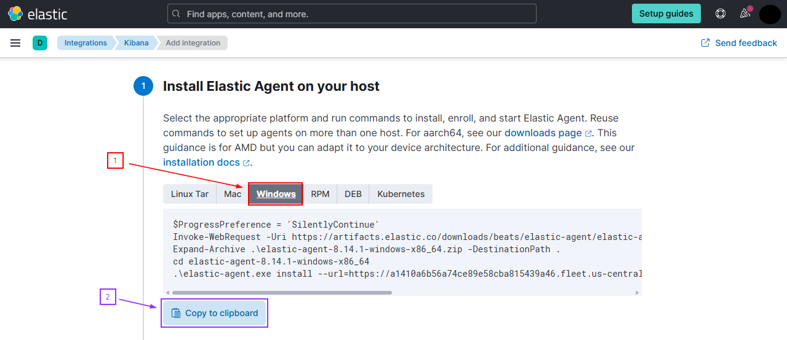

#### ELK in the Cloud
---

*This is part one of a three-part series.*
	[Part Two](./elastic_agent.md "Elastic Agents")
	[Part Three](./sysmon_logs.md "Configuring Sysmon")

---

ELK combines three technologies and provides a powerful solution when working with large data sets.  In addition, we are able to setup SIEM rules to alert us as defenders to attacks on our organization.

* E - Elasticsearch
* L - Logstash
* K - Kibana

ELK enables defenders to detect attacks and conduct threat hunting.

To learn ELK, we don't need several servers or to spend large sums of money.  We can get into the driver's seat and experiment with ELK by using the Elastic Cloud 14-day trial.  The trial does not require a credit card to get started. You only need an email and a password.

**1. Set up an account.**

[Start your free Elastic Cloud Trial](https://cloud.elastic.co/registration?fromURI=%2Fhome "https://cloud.elastic.co/registration?fromURI=%2Fhome")

This link is for the trial sign up page. Start a trial by signing up.

---

Watch your email for a confirmation. The email will look something similar to this.

Click "Verify and Accept."  You should be redirected to the cloud login page.  If you're not redirected, you can find it here.

[Elastic Cloud Log In](https://cloud.elastic.co/login "https://cloud.elastic.co/login")

---

After logging in, the page will look like this.

Fill out the proper field with the correct information pictured below and select the check boxes with red dots.

Once those fields are filled out click "Next"

---

**2. Start an ELK instance.**

Upon clicking **Next** you will see the following page.

 For my instance, I will be calling it "security-development". Make sure to enter the name of your deployment and click "Create Deployment".

Next we will see this page.

Elastic will present the credentials for this ELK stack. There is the option to download a CSV of the credentials. However you decide to hold onto these credentials, don't lose them.

Then we will need to wait for the continue button to turn blue, once that's done click continue.  

We will be greeted with menu of options, we want to skip that menu.

Then at the top of the page we want to click search and type **"kibana"** and hit enter.

Once the next page load we want to add **kibana**. Select **"Add Kibana"**

We will next be prompted to "Install Elastic Agent" This is what we are going to put on our machine to monitors what's happening. Click "Install Elastic Agent".  

The next page we meet will have a wall of text. Select **"windows"**.

We will need to click the **"Copy to Clipboard"**.

Keep this command saved.  It is recommended to paste this command into a text file where you won't lose it. In this example, I saved it to a file I called "agent.txt."  We will use this command later.

The ELK stack is now configured and we have our connection information saved.  Part two will cover how to install and configure an Elastic Agent.

[Part Two](./elastic_agent.md "Elastic Agents")
